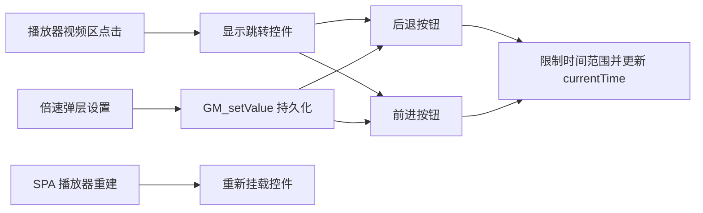

# 播放器左右跳转控件

Feature Name: player-seek-controls
Updated: 2026-07-19

## Description

该功能复用现有通用播放器控制器，在视频画面层挂载轻量左右跳转按钮。控件通过视频区点击显示，通过独立按钮点击执行跳转，并在短暂显示后淡出。

## Architecture



## Components and Interfaces

- `options.seekBackwardSeconds`：后退秒数，默认值为 10。
- `options.seekForwardSeconds`：前进秒数，默认值为 15。
- `mountSeekControls(ui)`：向当前播放器视频层挂载控件。
- `showSeekControls()`：显示控件并启动 2 秒隐藏计时器。
- `seekVideo(direction)`：计算并应用受视频范围约束的目标时间。
- 倍速弹层：提供 1-300 秒的后退和前进输入框。

## Data Models

```text
seekBackwardSeconds: number
seekForwardSeconds: number
```

## Correctness Properties

- 目标播放时间处于 `[0, video.duration]` 范围内。
- 后退和前进配置处于 `[1, 300]` 范围内。
- 每个当前播放器视频层最多存在一个跳转控件实例。
- 跳转图标点击事件停止传播，视频区普通点击事件继续传播给播放器。

## Error Handling

- 当前 video 元素缺失时忽略跳转请求。
- `currentTime` 无效时忽略跳转请求。
- 输入为空或无效时恢复对应默认值。
- 全屏状态下清除控件显示状态。

## Test Strategy

- 验证默认后退 10 秒和前进 15 秒。
- 验证视频开头与结尾的边界限制。
- 验证自定义值保存和页面重载恢复。
- 验证普通视频区点击仍触发播放器原有行为。
- 验证标准全屏和网页全屏隐藏。
- 验证 SPA 切视频后控件重新挂载。

## References

- `Bilibili - 未登录自由看.js`：播放器倍速控制、SPA 重挂载和持久化逻辑。
